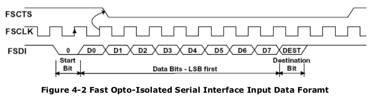

# iceDAQ
Real time data acquisition based on the Lattice ICEstick hardware

Goal: **16 simultaneous audio channels, 8-bit resolution @ 44100Hz sampling rate** (this hardware will be used to build a ["ball array" microphone](http://www.mattcastille.com/me/wp-content/upload/2009/09/tn_IMG_4178.jpg) that allows for electronic directivity/gain control).

Quick calculations say that it should be possible to record the 16 channels in parallel using two 8to1 multiplexers (74HC4051) and two ADCs ([AD7813](http://www.analog.com/media/en/technical-documentation/data-sheets/AD7813.pdf) gives 400ksps).

FTDI software modification for high speed serial
--

The main bottleneck was the serial port speed, since it is necessary to transmit at least 16 * 8 * 44100bits/s. We can see that **115200 bauds are not enough**. That is why we have researched the characteristics of the FTDI module on board the ICEstick (FT2232H).
For high-speed applications, the most common approach is to use the "245 FIFO" mode, where the FTDI chip reads 8 bit values in parallel (8 physical pins) and sends the byte through the USB port.
Since those pins are not correctly connected in the ICEstick board, we needed a different approach. So we found another working mode for the FTDI, called ["Fast Opto-Isolated Serial Mode"](https://github.com/carlosgs/iceDAQ/raw/master/doc/AN_131_FT2232D_H_Fast%20Opto-Isolated%20Serial%20Interface%20mode.pdf).

This mode is like a serial port but with a clock signal (up to 12MHz in the ICEstick), so the data rate limit is much higher.
Best part of it is that **no additional drivers seem to be necessary in order to have access to the higher velocities (>5Mbps)** from Python.
Here is a "logic analyzer" script that shows in the terminal the status of 8 pins of the ICEstick board:  
Verilog code: <https://github.com/carlosgs/iceDAQ/tree/master/logic_analyzer>  
Python script: <https://github.com/carlosgs/iceDAQ/blob/master/logic_analyzer/python/readAndPrint.py>  

Note: In order to use the code **it is first necessary to re-configure the FTDI module on board the ICEstick**. This is done with the [FT_PROG](http://www.ftdichip.com/Support/Utilities.htm#FT_PROG) program (only for windows... we need to find alternatives).
Once the program is running, you should select "Port B->Hardware" and assign the "OPTO Isolate" mode ([screenshot of the menu](https://sites.google.com/site/100randomtask/usb-to-serial-converter-samples/ft2232-to-adc0820-adc-demo/FTprog%20Screenshot.JPG?attredirects=0))  
*It is important not to modify Port A, since the FPGA is programmed through that port*  
To revert the changes, you just need to do the same thing and select back the "RS232 UART" mode.

Accurate sampling frequency using a PLL
--

Next task is to generate a 44100kHz clock using the PLLs (phase-locked loops). Example: [generating a 1Hz signal](pll_example/pll_example.v).

ideDAQ
--

  
[Picture by Maxwell Hamilton (CC-BY-SA)](https://www.flickr.com/photos/mualphachi/6960160767)  

License  
--
Author: Carlos García Saura  
License: **Attribution - Share Alike - Creative Commons (<http://creativecommons.org/licenses/by-sa/4.0/>)**  

Disclaimer  
--
This hardware/software is provided "as is", and you use the hardware/software at your own risk. Under no circumstances shall any author be liable for direct, indirect, special, incidental, or consequential damages resulting from the use, misuse, or inability to use this hardware/software, even if the authors have been advised of the possibility of such damages.  

