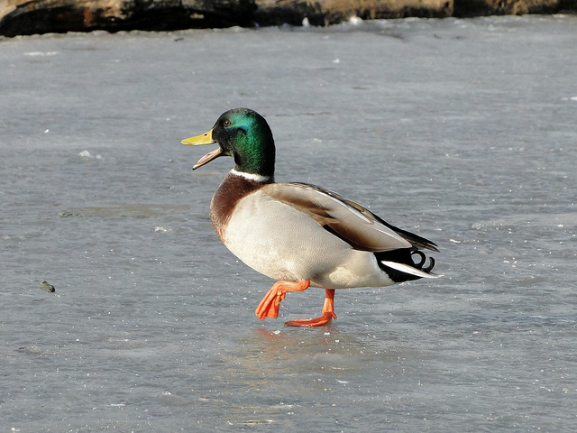

# iceDAQ
Real time data acquisition based on the Lattice ICEstick hardware

Goal: 16 channel, 8-bit resolution @ 44100Hz sampling rate

  
[Picture by Maxwell Hamilton (CC-BY-SA)](https://www.flickr.com/photos/mualphachi/6960160767)  

License  
--
Author: Carlos García Saura  
License: **Attribution - Share Alike - Creative Commons (<http://creativecommons.org/licenses/by-sa/4.0/>)**  

Disclaimer  
--
This hardware/software is provided "as is", and you use the hardware/software at your own risk. Under no circumstances shall any author be liable for direct, indirect, special, incidental, or consequential damages resulting from the use, misuse, or inability to use this hardware/software, even if the authors have been advised of the possibility of such damages.  

