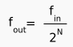

# Generating custom frequencies in the ice40 using a PLL

The aim of this code is to provide a tool that automatically generates parameters for a Phase-Locked Loop (PLL) in order to generate a custom frequency.  

This code uses two stages: a PLL and a prescaler.  

In first place, the PLL generates a frequency that falls within its working range (16 to 275 MHz).  
  
(from the [Lattice docs](http://www.latticesemi.com/~/media/LatticeSemi/Documents/ApplicationNotes/IK/iCE40sysCLOCKPLLDesignandUsageGuide.pdf?document_id=47778) page 7)  

Then, a simple prescaler  divides that frequency in multiples of two.  
  
([from the Juan Gonzalez FPGA tutorials](https://github.com/Obijuan/open-fpga-verilog-tutorial/wiki/Cap%C3%ADtulo-5%3A-Prescaler-de-N-bits))  


If you want to generate a specific frequency, you could calculate the values of DIVR, DIVF and N that match 
But how do you select proper values in order to match a g? Check out an easy way:  

1) Getting the parameters
--

Use the python script <calc_pll_parameters.py> to get the proper values for DIVR, DIVF and PRESCALER_N.  
For example, if you want to generate a 1Hz signal:  
```
$ python calc_pll_parameters.py 

Type the desired output frequency (i.e. 44100). Value in Hz: 1

Now program the PLL with one of the following sets of parameters:
 1) DIVR=1010  DIVF=1111010  PRESCALER_N=27  Fout=0.999732451005Hz (error=0.000267548994584Hz)
 2) DIVR=0100  DIVF=0000110  PRESCALER_N=24  Fout=1.00135803223Hz (error=0.00135803222656Hz)
 3) DIVR=0100  DIVF=0001101  PRESCALER_N=25  Fout=1.00135803223Hz (error=0.00135803222656Hz)
 4) DIVR=0100  DIVF=0011011  PRESCALER_N=26  Fout=1.00135803223Hz (error=0.00135803222656Hz)
 5) DIVR=0100  DIVF=0110111  PRESCALER_N=27  Fout=1.00135803223Hz (error=0.00135803222656Hz)
```

2) Fit the parameters into the verilog code
--

In the example code we have used the first set of parameters, which yields a frequency of about 0.9997Hz (this is an error of ~0.0003Hz)
```
DIVR=1010
DIVF=1111010
PRESCALER_N=27  
```

If you open the <custom_pll.v> file you'll observe these values already fitted into the code.


3) Program the FPGA
--

Finally you can program the board. If you use the example code, a red LED should blink at approximately 1Hz.  

```
$ make sint
$ sudo iceprog custom_pll.bin
```

IMPORTANT READ: future work
--
Currently the approach is very simple, and does not take into account "Fine Delay Adjustments" (FDA) nor configurations of the Voltage Controlled Oscillator (VCO) such as DIVQ and FILTER_RANGE. This may cause problems since either the VCO or the phase detector may not be operating within its working range.  
**You should always check the outputs with an oscilloscope in order to verify that they are square waves of the desired frequency**  


Acknowledgements
--
This code has been possible thanks to Clifford Wolf  
<https://github.com/cliffordwolf/yosys/issues/107#issuecomment-162163626>

